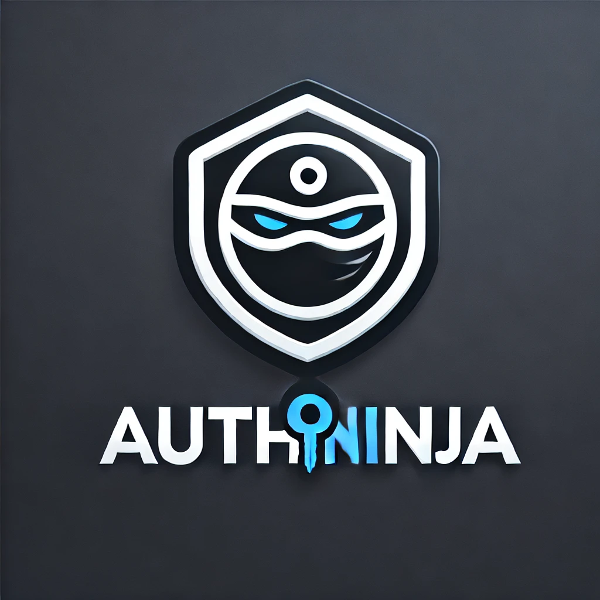

# AuthNinja

  

AuthNinja is a secure authentication system implemented in C++. The project follows **SOLID principles** to ensure a clean and maintainable codebase.

## How the Code Respects SOLID Principles

1. **Single Responsibility Principle (SRP)**:
   - Each class has a single responsibility:
     - `Hashing`: Handles password hashing and salt generation.
     - `FileHandler`: Manages file operations (storing and retrieving user data).
     - `UserRegistration`: Handles user registration logic.
     - `UserLogin`: Handles user login logic.
     - `PasswordVerification`: Handles password verification logic.
   - This ensures that each class is focused on one task, making the code easier to maintain and extend.

2. **Open/Closed Principle (OCP)**:
   - The system is open for extension but closed for modification:
     - New hashing algorithms can be added to the `Hashing` class without modifying existing code.
     - New file storage formats can be added to the `FileHandler` class without affecting other modules.
   - This allows the system to evolve without breaking existing functionality.

3. **Liskov Substitution Principle (LSP)**:
   - Derived classes (e.g., `Hashing`) can be substituted for their base classes without altering the correctness of the program:
     - If a new hashing algorithm is implemented, it can replace the existing one without affecting other modules.
   - This ensures that the system remains robust and flexible.

4. **Interface Segregation Principle (ISP)**:
   - Interfaces are segregated to ensure that classes only implement methods they need:
     - `Hashing` only provides methods for hashing and salt generation.
     - `FileHandler` only provides methods for file operations.
   - This prevents classes from being forced to implement unnecessary methods.

5. **Dependency Inversion Principle (DIP)**:
   - High-level modules (e.g., `UserRegistration`, `UserLogin`, `PasswordVerification`) depend on abstractions (e.g., `Hashing`, `FileHandler`) rather than concrete implementations:
     - This allows the system to be more flexible and easier to test, as dependencies can be mocked or replaced.

## How to Run

1. Clone the repository.
2. Install dependencies (e.g., `g++`, `cmake`, `libcrypto++-dev`).
3. Build the project using `cmake . && make`.
4. Run the tests using `./AuthNinjaTests`.

## GitHub Actions

The project includes a GitHub Actions workflow to automate testing on every push or pull request to the `main` branch.

## Contributors

- Eya Abidi
- Ines Jabri
- Ahmed Dhia Dridi
- Amina Jebari
- Mohamed Yessine Aifa
